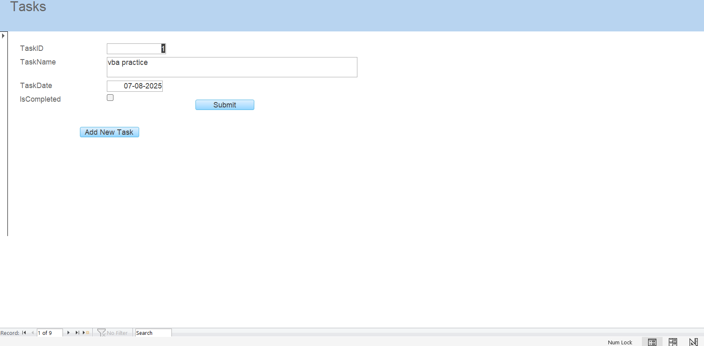

# 📅 Daily Task Reminder

This is a small Microsoft Access project I built to keep track of daily tasks.  
When you open it, it shows a popup with all the tasks due today.  
You can add new tasks, mark them as complete, or leave them as incomplete to remind you later.

---

## 🚀 What it can do
- Add, edit, and delete tasks easily.
- Show a popup every day with incomplete tasks.
- Mark tasks as complete with a checkbox and submit button.
- Store all tasks in one table so it’s easy to manage.
- Simple form-based interface so it’s easy to use.

---

## 🖼️ Screenshots

### Main Form

### Daily Tasks Popup

---

## 🛠️ How to use it
1. Open the database in Microsoft Access (2016 or later works best).
2. When it opens, a popup will show today’s tasks that aren’t complete.
3. Add a new task using the **Add New** button.
4. Tick the checkbox and click **Submit** to mark a task as done.
5. If you leave it unticked, it will stay on the reminder list.

---

## 📂 What’s in this project
DailyTaskReminder.accdb   # The main Microsoft Access database
DailyTaskReminder.bas     # Exported VBA module with main code
Form_frmTasks.cls         # VBA code for the task form
form-view.png             # Screenshot of the main form
popup.png                 # Screenshot of the daily popup
README.md                 # Project description and instructions

